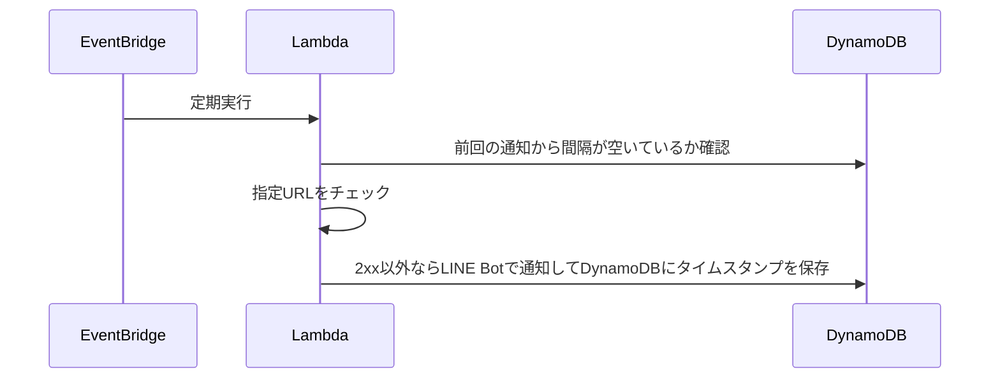

# dead-or-line

指定されたURLにHTTP GETリクエストを送信し、2xx以外が返ってきたらLINE Botで通知する。

## 構成

VPCは使用しません。

```mermaid
sequenceDiagram;
    EventBridge->>Lambda: 定期実行
    Lambda->>DynamoDB: 前回の通知から間隔が空いているか確認
    Lambda->>Lambda: 指定URLをチェック
    Lambda->>DynamoDB: 2xx以外ならLINE Botで通知してDynamoDBにタイムスタンプを保存
```

## 使い方

後で書く