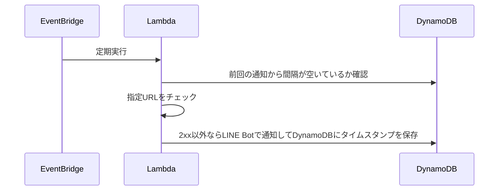

# dead-or-line

指定されたURLにHTTP GETリクエストを送信し、2xx以外が返ってきたらLINE Botで通知する。

## 構成

VPCは使用しません。



## 環境変数

- `TARGET_URL`: 監視対象のURL
- `NOTICE_INTERVAL`: 監視対象のURLが連続で2xx以外を返した時に通知しすぎないように空ける最低間隔(分)
- `DYNAMODB_TABLE_NAME`: DynamoDBテーブル名
- `DYNAMODB_KEY`: DynamoDBで使用するキー名
- `LINE_TOKEN`: LINE botのchannel access token
- `LINE_BASE_MESSAGE`: LINE botから送信するメッセージ。`{url}`は`TARGET_URL`で置換される
- `LINE_TO`: LINE botでプッシュメッセージを送信する際に使うuserId、groupId、またはroomId（指定しない場合はブロードキャストメッセージになる）

## 使い方

### 簡単なセットアップ

```sh
git clone https://github.com/takumi3488/dead-or-line.git
cd dead-or-line
bash setup.sh
```

### カスタムセットアップ

リポジトリをクローン後、`terraform/variables.tf` で定義された変数を `terraform/terraform.tfvars` に設定してから、`terraform` ディレクトリ内で `terraform apply` する。

### 削除

`bash delete.sh` か `terraform` ディレクトリ内で `terraform destroy` を実行する。
