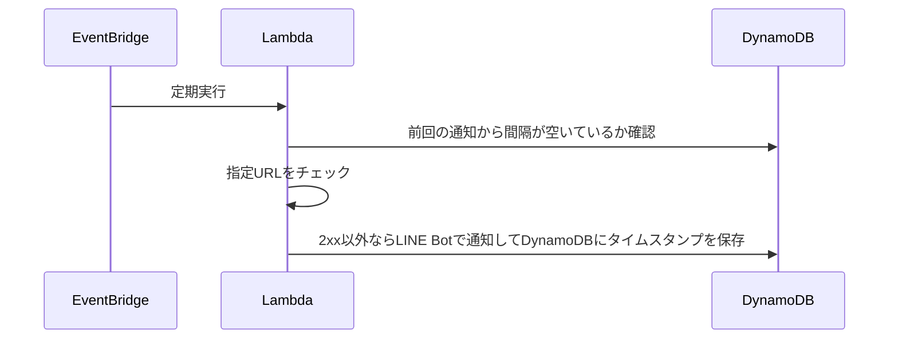

# dead-or-line

指定されたURLにHTTP GETリクエストを送信し、2xx以外が返ってきたらLINE Botで通知する。

## 構成

VPCは使用しません。

## 環境変数

`TARGET_URL`: 監視対象のURL
`DYNAMODB_TABLE_NAME`: DynamoDBテーブル名
`DYNAMODB_KEY`: DynamoDBで使用するキー名
`LINE_TOKEN`: LINE botのchannel access token
`LINE_BASE_MESSAGE`: LINE botから送信するメッセージ。`{url}`は`TARGET_URL`で置換される
`LINE_TO`: LINE botでプッシュメッセージを送信する際に使うuserId、groupId、またはroomId（指定しない場合はブロードキャストメッセージになる）

## 使い方

後で書く
